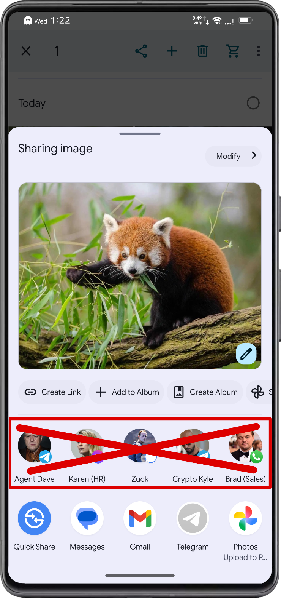

# CleanShare

Xposed module that removes Direct Share's suggested contact/conversation shortcuts
from Android's Share Sheet.


<div align="center">
  
</div>

## About

Direct Share suggests contacts you emailed once five years ago, colleagues from jobs you no longer
have, and people you'd rather not be reminded of. The suggestions
are [rarely useful](https://support.google.com/android/thread/153774734). I've yet to hit a case
where they helped. Might as well cut the row and skip the hassle.

CleanShare tricks the Share Sheet into thinking it's running on a low-RAM device. Android then skips
the Direct Share pipeline to save resources, so the row never loads.

On devices
with [Android System Intelligence](https://www.androidpolice.com/what-is-android-system-intelligence/),
it also blocks backend shortcut queries to prevent share target profiling.

## Features

- Hide Direct Share suggestions from the share sheet
- Block share target profiling via Android System Intelligence
- Hide Quick Share / Nearby Share from share sheet results
- Delete shared screenshots after sharing with configurable delay (root required)
- Move to trash or permanently delete
- Built-in settings app with Material 3 UI

## Requirements

- Android 11 (API 30) or higher
- An LSPosed Manager version with API 101 support (required for now)
- Pixel or AOSP-based ROM (Other OEMs are untested)

## Installation

1. Download the APK:

   <a href="https://f-droid.org/packages/eu.hxreborn.cleanshare"></a>
   <a href="https://apt.izzysoft.de/fdroid/index/apk/eu.hxreborn.cleanshare?repo=main"></a>
   <a href="../../releases"></a>
   <a href="http://apps.obtainium.imranr.dev/redirect.html?r=obtainium://app/%7B%22id%22%3A%22eu.hxreborn.cleanshare%22%2C%22url%22%3A%22https%3A%2F%2Fgithub.com%2Fhxreborn%2Fcleanshare%22%2C%22author%22%3A%22rafareborn%22%2C%22name%22%3A%22CleanShare%22%2C%22additionalSettings%22%3A%22%7B%5C%22includePrereleases%5C%22%3Afalse%7D%22%7D"></a>

2. Install and enable the module in LSPosed.
3. Configure the scope:

   **Android 13+**
    - Intent Resolver (`com.android.intentresolver`)
    - Android System Intelligence (`com.google.android.as`)

   **Android 11-12**
    - System Framework (`android`)
    - Android System Intelligence (`com.google.android.as`)

4. Reboot your device.

System Framework is only needed if you use the delete-after-share feature. The module checks
your Android version and only applies what's needed.

## FAQ

<details>
<summary>What does "Move to trash" do?</summary>

It uses Android's standard [MediaStore trash](https://developer.android.com/reference/android/provider/MediaStore#IS_TRASHED).
The file gets flagged as trashed but stays on disk for 30 days before Android auto-removes it.
You can recover it from the trash in Google Photos, Files by Google, or any gallery app that
supports MediaStore trash.

</details>

<details>
<summary>Why doesn't the checkbox appear after editing a screenshot?</summary>

When you edit a screenshot, the editor creates a temporary copy with a different filename. The
module tries to find the original screenshot by querying
[MediaStore](https://developer.android.com/reference/android/provider/MediaStore) for recent
files in your Screenshots folder, but it depends on the filename matching a configurable pattern.
If your device uses a non-standard naming convention, it may not find a match. You can adjust
the pattern in settings.

</details>

<details>
<summary>Why is there a delay before deletion?</summary>

The receiving app needs time to process the shared file. If the file is deleted immediately,
the share may fail. The delay is configurable in settings.

</details>

<details>
<summary>Does Quick Share filtering work on all devices?</summary>

It targets the standard AOSP
[IntentResolver](https://cs.android.com/android/platform/superproject/+/main:packages/modules/IntentResolver/)
package. Some OEMs (e.g. HyperOS) use heavily modified share sheets with different packages
and are currently unsupported.

</details>

<details>
<summary>Quick Share still appears when sharing from app X</summary>

Some apps (e.g. Firefox) implement their own custom share sheet instead of using Android's native
one. CleanShare can only hook the system share sheet (`com.android.intentresolver`). If an app
rolls its own, there's nothing the module can do about it.

</details>

<details>
<summary>Do I need root for all features?</summary>

No. Direct Share hiding and Quick Share filtering work without root. Only the delete-after-share
feature requires root because it needs to modify MediaStore entries and delete files outside the
app's [storage sandbox](https://developer.android.com/training/data-storage#scoped-storage).

</details>

## Build

```bash
git clone https://github.com/hxreborn/cleanshare.git
cd cleanshare
./gradlew assembleRelease
```

Requires JDK 21 and Android SDK. Configure `local.properties`:

```properties
sdk.dir=/path/to/android/sdk

# Optional signing
RELEASE_STORE_FILE=<path/to/keystore.jks>
RELEASE_STORE_PASSWORD=<store_password>
RELEASE_KEY_ALIAS=<key_alias>
RELEASE_KEY_PASSWORD=<key_password>
```

## License

<a href="LICENSE"></a>

This project is licensed under the GNU General Public License v3.0. See [LICENSE](LICENSE) for details.
