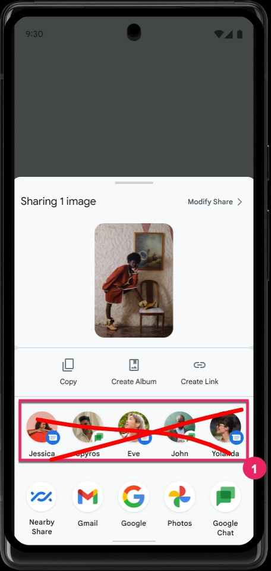

# CleanShare

CleanShare is an Xposed module that removes Direct Share's suggested contact/conversation shortcuts from Android's Share Sheet.


<p align="center">
  
</p>


## Overview

Direct Share suggests contacts you emailed once five years ago, colleagues from jobs you no longer have, and people you'd rather not be reminded of. The suggestions are [rarely useful](https://www.androidpolice.com/how-to-disable-androids-annoying-direct-share-pop-up-on-the-share-menu-samsung-lg-and-google/). I've yet to hit a case where they helped. Might as well cut the row and skip the hassle.

## How It Works

The module tricks IntentResolver into thinking it's running on a low-RAM device. When Android detects this, it skips the Direct Share pipeline to save resources so the row never loads.

On devices with [Android System Intelligence](https://www.androidpolice.com/what-is-android-system-intelligence/), an optional second hook blocks backend shortcut queries entirely.

## Compatibility

Works on Pixel and AOSP-based ROMs. OEM-modified ROMs are untested.

## Requirements

- Android 14 (API 34) or higher
- Xposed Framework: [LSPosed](https://github.com/JingMatrix/LSPosed) (JingMatrix fork recommended)

## Installation

1. Download the APK from [Releases](../../releases)
2. Enable in LSPosed with scope:
   - `com.android.intentresolver` – hides the Direct Share row
   - `com.google.android.as` – blocks shortcut profiling (Google claims this data stays in [Private Compute Core](https://security.googleblog.com/2021/09/introducing-androids-private-compute.html) and never leaves the device, but it's still processed by a proprietary Google binary.)
3. Reboot

## Build

1. Install JDK 21, Android SDK

2. Configure SDK path in `local.properties`

   ```properties
   sdk.dir=/path/to/android/sdk
   ```

3. (Optional) Sign release builds by adding to `local.properties`:

   ```properties
   RELEASE_STORE_FILE=<path/to/keystore.jks>
   RELEASE_STORE_PASSWORD=<store_password>
   RELEASE_KEY_ALIAS=<key_alias>
   RELEASE_KEY_PASSWORD=<key_password>
   ```

4. Build APK

   ```bash
   git clone --recurse-submodules https://github.com/hxreborn/cleanshare.git
   cd cleanshare
   ./gradlew buildLibxposed
   ./gradlew assembleRelease
   ```

## License

<a href="LICENSE"></a>

This project is licensed under the GNU General Public License v3.0 – see the [LICENSE](LICENSE) file for details.
